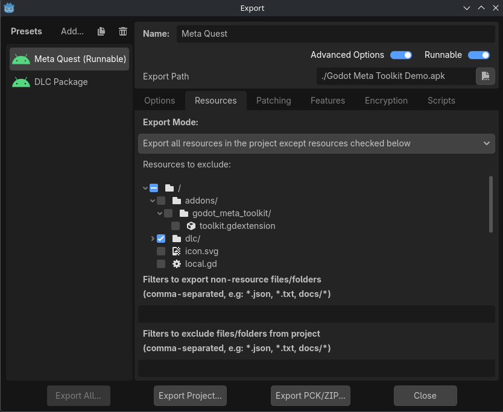
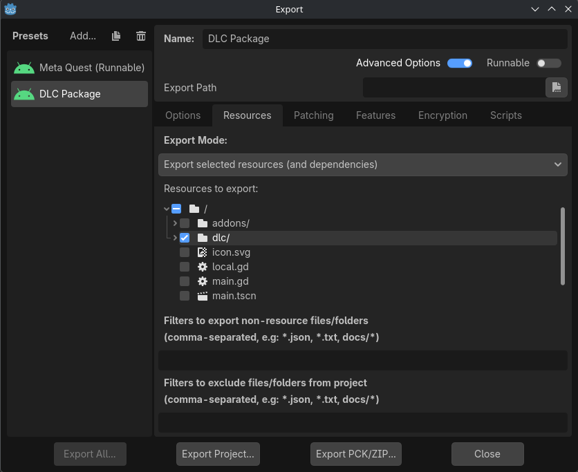

.. _manual_downloadable_content:

Downloadable Content
====================

If you'd like to provide users access to additional content for your app that doesn't
ship with the initial download, the Platform SDK provides this ability. For info on
how to initially set up downloadable content (DLC) in an app, see the Meta documentation for
`Add-ons (DLC and IAP) <https://developers.meta.com/horizon/resources/add-ons>`_.
This page provides some examples of exporting and accessing DLC using the Platform SDK.

Exporting DLC
-------------

While files of any type may be used as DLC, for ease of use it is recommended to use **PCK** files.
PCKs are easily exported from Godot, and it's trivial to load the contained resources at runtime.
To ensure that your DLC files are not exported with your runnable project, consider placing all
DLC files in a dedicated directory in your project, and exclude that directory from your normal export.

Additional export presets can be created to export PCKs containing only the desired resources.

For info on how to upload the DLC files, see the Meta documentation on
`uploading files associated with add-ons <https://developers.meta.com/horizon/resources/add-ons-setup#upload-files-associated-with-your-add-ons>`_.

Checking Download Status
------------------------

Before attempting to download or load DLC, you should check to see that it is available or already downloaded.
Do this by obtaining asset files with :ref:`asset_file_get_list_async<class_metaplatformsdk_method_asset_file_get_list_async>`,
and checking a file's :ref:`download_status<class_metaplatformsdk_assetdetails_property_download_status>`.

.. note::

    It is recommended to use asset IDs to identify desired asset files, as the returned asset file
    details list may contain multiple files with the same filename. This occurs when multiple
    versions of the same asset file have been uploaded (i.e. the asset has been updated). These
    asset IDs can be viewed on the Quest Developer Dashboard after uploading a DLC file and
    releasing a build of the app. Find them under the build's "Expansion files" info.

.. code-block:: gdscript

    var result := await MetaPlatformSDK.asset_file_get_list_async().completed
    if result.is_error():
        # Error getting the asset file list.
        return

    var asset_details_array := result.get_asset_details_array()
    for asset_details in asset_details_array:
        if asset_details.filepath.contains(ASSET_ID):
            # Check asset_details.download_status here.
            pass

Downloading DLC
---------------

If the desired asset's download status is ``"available"``, you may initiate downloading the DLC with
:ref:`asset_file_download_by_id<class_metaplatformsdk_method_asset_file_download_by_id_async>`.

.. code-block:: gdscript

    var result := await MetaPlatformSDK.asset_file_download_by_id_async(durable_asset_details.asset_id).completed
    if result.is_error():
        # Error downloading asset by id.
        return

    # Download started successfully.

If the above function doesn't result in an error, this only indicates that a download has **started**,
not that the asset file has successfully downloaded. Before attempting to load the DLC, you'll have to
wait for a message from the Platform SDK indicating that the download has completed.

To receive this message, you should have some function connected to the Platform SDK's
:ref:`notification_received<class_metaplatformsdk_signal_notification_received>` signal.
You might connect this after successfully initializing the Platform SDK on app startup:

.. code-block:: gdscript

    MetaPlatformSDK.notification_received.connect(on_notification_received)

In the ``on_notification_received`` function, we can then call the logic to load
our downloaded asset file when we receive a message that the download has completed.

.. code-block:: gdscript

    func on_notification_received(message):
        if message.is_error():
            # Error sending notification.
            return

        if message.type == MESSAGE_NOTIFICATION_ASSET_FILE_DOWNLOAD_UPDATE:
            var download_update := message.get_asset_file_download_update()
            if download_update.completed:
                # You may now load the asset file.
                pass

Loading DLC
-----------

Once you've determined that the asset file has completed downloading, or has been downloaded previously,
you may now load the asset file. The asset's filepath is provided by the :ref:`filepath<class_metaplatformsdk_assetdetails_property_filepath>`
property of the previously retrieved asset details.
Assuming that the downloaded asset file is a PCK, you could load its contents using
`ProjectSettings.load_resource_pack <https://docs.godotengine.org/en/stable/classes/class_projectsettings.html#class-projectsettings-method-load-resource-pack>`_.

.. note::

    In Godot 4.6 onward, Godot is able to access the Platform SDK's provided filepath without
    any additional permissions. If you're using an earlier version, you will either have to export
    with the "Manage External Storage" permission or cherry-pick [the fix](https://github.com/godotengine/godot/commit/b40afd67815bffa6129118dd1f095b675fa9cd80)
    in a custom build of the engine.

.. code-block:: gdscript

    func load_asset_file(filepath):
        if not FileAccess.file_exists(filepath):
            # No file found at provided filepath.
            return

        if not ProjectSettings.load_resource_pack(filepath):
            # Error loading resource pack from provided filepath.
            return

        # DLC resources are now loaded.

Once the resource pack has been successfully loaded, those resources can be accessed
at their typical project filepaths. To see an example of this, check out the
`Godot Meta Toolkit Demo Project <https://github.com/godot-sdk-integrations/godot-meta-toolkit/tree/main/demo>`_.
